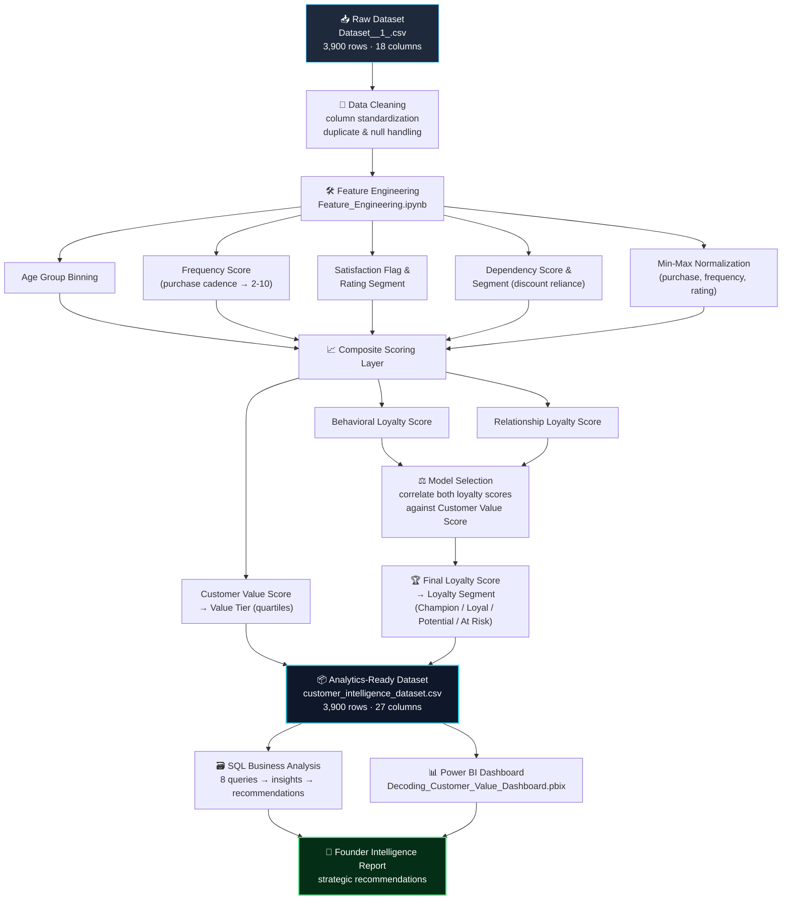

<div align="center">

# 🧠 Decoding Customer Value
### Founder Intelligence Dashboard — Customer Loyalty & Value Analytics Platform

*Turning 3,900 raw transactions into a founder-ready intelligence system: who your customers are, what makes them valuable, and where to invest next.*

[](https://www.python.org/)
[](https://pandas.pydata.org/)
[](https://scikit-learn.org/)
[](sql/queries.sql)
[](dashboard/)
[](LICENSE)

**[Explore the Dashboard](#-dashboard-preview) · [Read the Insights](#-key-business-insights) · [Reproduce the Pipeline](#-getting-started) · [View Architecture](#-project-architecture)**

</div>

---

## 📌 Overview

**Decoding Customer Value** is an end-to-end customer intelligence project built to answer the questions every founder and growth team actually cares about:

> *"Who are our customers? Are they loyal, or just chasing discounts? Which segments, categories, and regions should we double down on — and which are quietly bleeding value?"*

Starting from a raw **3,900-row retail transactions dataset**, this project engineers a complete **Customer Value & Loyalty Intelligence layer** — combining behavioral scoring, SQL-driven business analysis, and an interactive Power BI dashboard — to convert transactional noise into a founder-ready decision system.

This repository documents the **full analytics lifecycle**: raw data → feature engineering → SQL business analysis → executive dashboard → strategic recommendations — exactly the workflow expected of a Data/Business Analyst in a real organization.

---

## ✨ Highlight Features

| | |
|---|---|
| 🎯 **Custom Loyalty Scoring Engine** | Two competing loyalty models (Behavioral vs. Relationship) built, correlated against customer value, and the stronger predictor auto-selected programmatically |
| 💎 **Customer Value Score & Value Pyramid** | Normalized, quantile-based value tiering (`Very Low → Low → Medium → High`) built from purchase amount & purchase history |
| 🧩 **4-Segment Loyalty Framework** | Every customer classified into `Champion`, `Loyal`, `Potential Loyalist`, or `At Risk` using quartile-based segmentation |
| 💸 **Discount-Dependency Detection** | Separates *genuinely loyal* customers from *discount-chasers* — a metric most retail dashboards miss entirely |
| 🗺️ **Geographic Demand Intelligence** | Ranks all 50 US states by *organic demand* vs. *promotion dependency* to guide regional marketing spend |
| 📊 **8 Founder-Ready SQL Analyses** | Each query maps directly to a business question, insight, and actionable recommendation — not just raw output |
| 🖥️ **Interactive Power BI Dashboard** | 6-panel executive dashboard with cross-filtering by segment, region, and promotion status |
| 🔁 **Fully Reproducible Pipeline** | One notebook regenerates the entire analytics-ready dataset from the raw file — no black boxes |

---

## 🏗️ Project Architecture



**Pipeline in one line:** `Raw CSV → Cleaning → Feature Engineering → Composite Scoring (Value + Loyalty) → SQL Analysis → Power BI → Strategic Insights`

---

## 📂 Repository Structure

```
decoding-customer-value/
│
├── 📁 data/
│   ├── 📁 raw/
│   │   └── raw_customer_dataset.csv          # Original, untouched source data (3,900 × 18)
│   └── 📁 processed/
│       └── customer_intelligence_dataset.csv # Feature-engineered analytics-ready dataset (3,900 × 27)
│
├── 📁 notebooks/
│   └── Feature_Engineering.ipynb             # Full cleaning + scoring pipeline (single source of truth)
│
├── 📁 sql/
│   ├── queries.sql                           # 8 runnable, commented business-analysis queries
│   └── SQL_Analysis_Report.pdf               # Formatted report: question → query → output → insight → recommendation
│
├── 📁 dashboard/
│   ├── Decoding_Customer_Value_Dashboard.pbix   # Interactive Power BI dashboard file
│   └── 📁 screenshots/
│       └── dashboard_overview.png            # Full dashboard preview image
│
├── 📁 docs/                                   # Architecture notes & supporting documentation
│
├── requirements.txt                          # Python dependencies
├── .gitignore
├── LICENSE
└── README.md                                 # You are here
```

---

## 🗂️ Dataset at a Glance

| Stage | File | Rows | Columns | Description |
|---|---|---|---|---|
| Raw | `data/raw/raw_customer_dataset.csv` | 3,900 | 18 | Original retail transaction export (demographics, purchase, category, payment) |
| Processed | `data/processed/customer_intelligence_dataset.csv` | 3,900 | 27 | Enriched with 9 engineered features: scores, tiers & segments |

**Engineered columns added during feature engineering:**

`age_group` · `frequency_score` · `satisfaction_flag` · `rating_segment` · `dependency_score` · `dependency_segment` · `customer_value_score` · `value_tier` · `behavioral_loyalty_score` · `relationship_loyalty_score` · `loyalty_score` · `loyalty_segment` · `high_promo_user`

---

## 🧮 How the Scores Are Built

**1. Frequency Score** — purchase cadence mapped to a 2–10 scale (`Weekly → 10 … Annually → 2`)

**2. Dependency Score** — `(discount_applied + promo_code_used) / 2` → segmented into `Highly Promo Dependent` / `Moderately Dependent` / `Loyal Customer`

**3. Customer Value Score** — average of normalized purchase amount and normalized previous purchases → binned into quartile-based `value_tier`

**4. Loyalty Score (two candidate models, best one auto-selected by correlation with Customer Value Score):**

```
Behavioral Loyalty  = 0.40 × previous_purchases_norm + 0.40 × frequency_norm + 0.20 × subscription_status
Relationship Loyalty = 0.35 × previous_purchases_norm + 0.25 × subscription_status + 0.25 × review_norm + 0.15 × frequency_norm
```

The model with the **higher correlation to `customer_value_score`** is programmatically selected as the final `loyalty_score`, which then drives the **4-tier `loyalty_segment`**: `Champion` (top quartile) → `Loyal` → `Potential Loyalist` → `At Risk` (bottom quartile).

---

## 📊 Dashboard Preview

<div align="center">

</div>

**The 6-panel Power BI dashboard covers:**
1. **Customer Value Distribution** — headcount across all four value tiers
2. **Discount Dependency by Segment** — which loyalty segments lean on promotions
3. **Loyalty Distribution Across Age Groups** — demographic breakdown of each loyalty tier
4. **Brand Loyalty vs. Promotion Dependency by State** — top regions by dependency type
5. **Category Funnel** — average previous purchases across product categories, split by loyalty tier
6. **Product Categories Driving Loyalty** — loyalty score vs. purchase behavior, bubble-sized by category

Fully interactive with **global filters** for Customer Segment, Geographic Region, and Promotion Status.

---

## 🔎 Key Business Insights

| # | Question | Insight | Recommendation |
|---|---|---|---|
| 1 | What type of customers do we have? | Potential Loyalists (716) are the largest segment, closely followed by Loyal (709) | Run targeted conversion campaigns to move Potential Loyalists → Champions |
| 2 | How is the customer base distributed by value? | Near-even split across all 4 value tiers (677–705 each) | No one-size-fits-all strategy — build tier-specific playbooks |
| 3 | Who's genuinely loyal vs. discount-chasing? | 539 Champions are still "Highly Promo Dependent"; 519 "Loyal" customers are already At Risk | Wean Champions off discounts with loyalty perks; urgently re-engage At-Risk Loyals |
| 4 | What separates high vs. low value customers? | Loyalty score nearly doubles from Very Low (0.30) → High Value (0.58), while frequency stays flat | Invest in loyalty-building, not just purchase-frequency campaigns |
| 5 | Which categories drive retention? | Footwear (0.456) and Accessories (0.450) lead on loyalty & value; Outerwear lags | Prioritize marketing spend on Footwear & Accessories; audit Outerwear experience |
| 6 | Which regions show organic demand? | Kansas, Maine & Connecticut = low discount dependency; Iowa, Indiana & Hawaii = high | Shift ad spend toward organic-demand states; use loyalty offers (not discounts) elsewhere |
| 7 | Which age groups are most valuable? | Value & loyalty barely vary by age (0.493–0.501) | Segment by *behavior*, not demographics |
| 8 | What does the ideal (Champion) customer look like? | Male, 55+, buying Clothing & Accessories, with the highest loyalty scores | Build acquisition/retention campaigns around this profile and category pairing |

> Full query-by-query breakdown with formatted output tables is available in [`sql/SQL_Analysis_Report.pdf`](sql/SQL_Analysis_Report.pdf) and runnable SQL in [`sql/queries.sql`](sql/queries.sql).

---

## 🛠️ Tech Stack

| Layer | Tools |
|---|---|
| **Data Engineering** | Python, Pandas, NumPy |
| **Feature Scaling** | scikit-learn (`MinMaxScaler`) |
| **Business Analysis** | SQL (aggregate functions, GROUP BY, multi-dimensional segmentation) |
| **Visualization** | Power BI (interactive cross-filtered dashboard) |
| **Environment** | Jupyter Notebook |

---

## 🚀 Getting Started

### Prerequisites
- Python 3.10+
- Power BI Desktop (Windows) — only required to open/edit the `.pbix` dashboard

### Step-by-Step Reproduction

```bash
# 1. Clone the repository
git clone https://github.com/<your-username>/decoding-customer-value.git
cd decoding-customer-value

# 2. Create a virtual environment (recommended)
python -m venv venv
source venv/bin/activate        # Windows: venv\Scripts\activate

# 3. Install dependencies
pip install -r requirements.txt

# 4. Launch the feature engineering notebook
jupyter notebook notebooks/Feature_Engineering.ipynb

# 5. Run all cells
#    Input  : data/raw/raw_customer_dataset.csv
#    Output : data/processed/customer_intelligence_dataset.csv

# 6. Run the SQL analysis
#    Load customer_intelligence_dataset.csv into your SQL engine of choice
#    (PostgreSQL / MySQL / SQLite / BigQuery) and execute sql/queries.sql

# 7. Explore the dashboard
#    Open dashboard/Decoding_Customer_Value_Dashboard.pbix in Power BI Desktop
#    Point the data source to data/processed/customer_intelligence_dataset.csv if prompted
```

---

## 🏁 How This Repository Was Built (Project Log)

1. **Sourced** a raw retail transactions dataset (3,900 customers, 18 raw attributes)
2. **Cleaned** the data — standardized column names, removed duplicates, imputed missing review ratings
3. **Engineered features** — age groups, frequency scores, satisfaction flags, dependency scores/segments
4. **Normalized** key numeric features with Min-Max scaling for fair composite scoring
5. **Built two competing loyalty models** (Behavioral vs. Relationship) and selected the better-correlated one programmatically
6. **Derived value & loyalty tiers** using quartile-based segmentation
7. **Exported** the enriched dataset for downstream analysis
8. **Wrote 8 business-driven SQL analyses**, each with a question → query → output → insight → recommendation structure
9. **Designed a 6-panel Power BI dashboard** for interactive, filterable executive reporting
10. **Documented** the entire pipeline in this repository for reproducibility and portfolio presentation

---

## 🔭 Future Enhancements

- [ ] Predictive churn model (classify `At Risk` → `Churned` probability)
- [ ] RFM (Recency-Frequency-Monetary) analysis layer
- [ ] Automated ETL with Airflow/dbt for scheduled refreshes
- [ ] Deploy dashboard to Power BI Service with row-level security
- [ ] A/B test simulation for discount-reduction strategy on Champion segment

---

## 📄 License

This project is licensed under the [MIT License](LICENSE) — free to use, modify, and share for learning and portfolio purposes.

---

<div align="center">

### 💡 Built as an end-to-end Data Analytics portfolio project
**Data Cleaning → Feature Engineering → SQL Business Analysis → Power BI Dashboard → Strategic Insight**

If this project helped you, consider ⭐ starring the repo!

</div>
